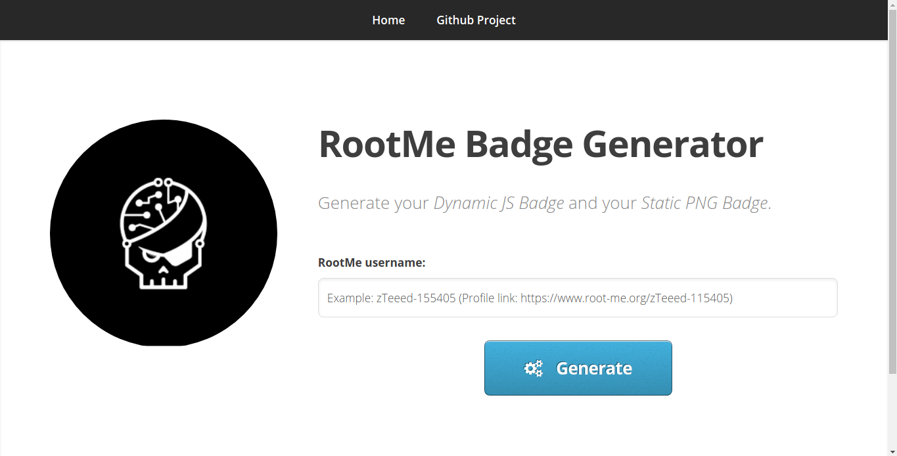
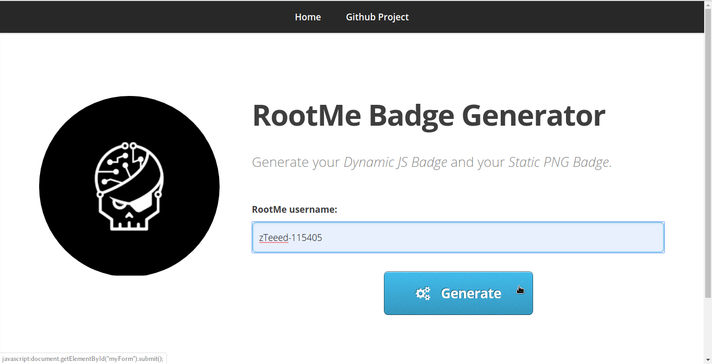
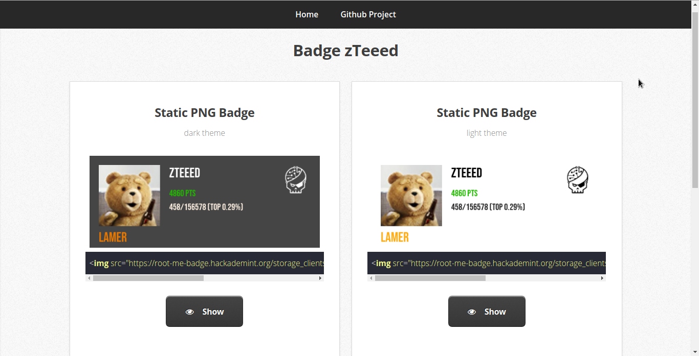
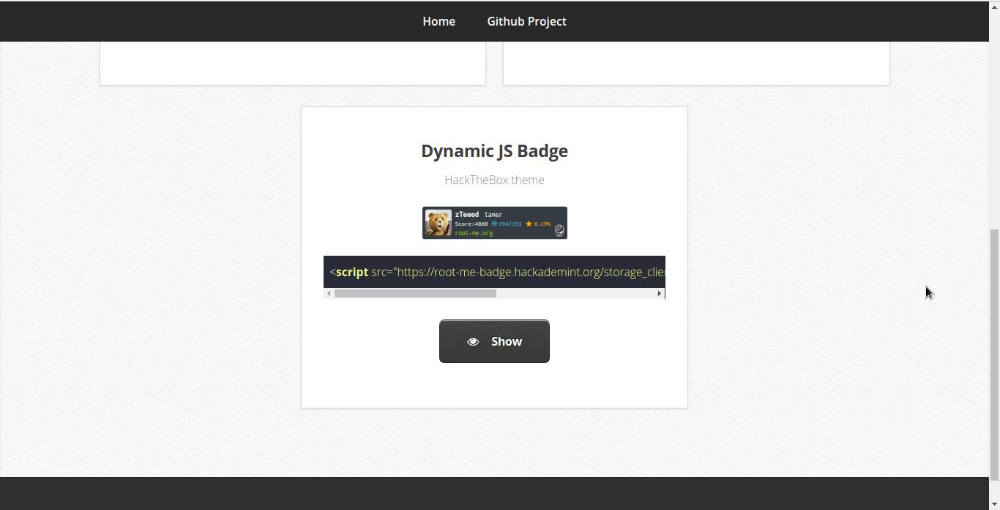

# Root-Me Badge Generator

## Description

**Root-Me Badge Generator** is a web application script that generates badges from Root-me profiles.

The original idea came from *Podalirius* on the Root-Me forums (https://www.root-me.org/?page=forum&id_thread=12859) \
I forked [this project](https://github.com/HexPandaa/RootMe-Badge-Generator) in order to use his static png badge generator. I changed the way to fetch data from [Root-Me website](https://www.root-me.org/) using my custom API (see [https://github.com/zteeed/Root-Me-API](https://github.com/zteeed/Root-Me-API)). \
Then, i built the web application and added a HackTheBox theme in order to add it next to my HackTheBox badge on [my website](https://duboc.xyz/about)

## Configuration

Edit `SECRET_KEY` with a random string in [env.py](env.py). \
Example:
```
SECRET_KEY=73498f3139b57a2543ba3a368dadb6ac
API_URL=https://root-me-api.hackademint.org
URL=https://root-me-badge.hackademint.org
STORAGE_FOLDER=storage_clients
```

## Install 

```
docker build -t badge_generator .
docker run -d -p 5000:80 --name badge_generator badge_generator
```

## Result

### Home page



## Fill the form with my RootMe username


# Static PNG Badges


# Dynamic JS Badge


